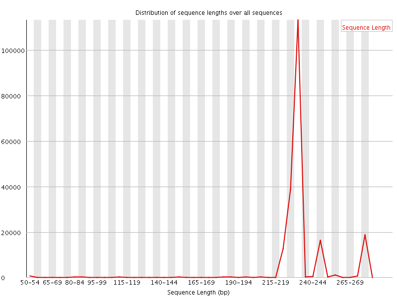

The orignal goal was to look for barcodes past the amplicon sequence to get a sense of barcode hopping (as was done for [this feline Whole Genome Sequencing sample](https://github.com/cwarden45/Bastu_Cat_Genome/tree/master/Basepaws_Notes/Read_QC)).  However, to better connnect the data on [Zenodo](https://zenodo.org/record/4546559), this separate repository was created.  So, to see the earliest history, you will have to view the [other reposistory](https://github.com/cwarden45/Bastu_Cat_Genome/tree/05197be171c846dcb21a7bfd1d1789cb6d405501/Basepaws_Notes/Read_QC/PRJNA513845-eDNA).  This probably won't be necessary, but I am making a note to be as transparent as possible.

Getting back to the analysis for this [post-publication review discussion](https://www.nature.com/articles/s41598-019-42455-9#article-comments), at first, I was not sure why my code is not identifying any barcodes (especially for the MiSeq samples), so I started to look at 1 example.

For example, here are the 1st 3 paired-end reads for SRR8423864:

```
>R1
ACTTTACTTGATTTTTGGTGGGTTATCAGGAGTTTTGGGTACTACTATGTCTGTGCTTATTCGTCTTCAATTAGCTAGTCCTGGCAACGATTTTTTAGGCGGTAATCATCAACTATATAATGTTATTGTTACAGCTCATGCCTTTTTAATGATTTTTTTTATGGTTATGCCAGTTCTTATAGGATGCTTTTGTAACTGGTTATTTCCACTTATTATTGGTGCACCTGATATT
>R2
CATATCATGTTCTCCAATCATAAGTGTTACTATCCAGTTACCAATTCCTCCTATAAGTACTGGCATAACCATAAAAAAAATCATTAAAAATGCATGAGCTGTAACAATAACATTATATAGTTGATGATTACCGCCTAAAAAATCGTTTCCAGGACTAGCTAATTTACTACGAATAAGCACAGACATAGTAGTACCCAAAACTCCTGATAACCCACCAAACATCAAGTAAAGTTTGCCCATGTCTTTCTTCTTAGT
>R2_revcom
ACTAAGAAGAAAGACATGGGCAAACTTTACTTGATGTTTGGTGGGTTATCAGGAGTTTTGGGTACTACTATGTCTGTGCTTATTCGTAGTAAATTAGCTAGTCCTGGAAACGATTTTTTAGGCGGTAATCATCAACTATATAATGTTATTGTTACAGCTCATGCATTTTTAATGATTTTTTTTATGGTTATGCCAGTACTTATAGGAGGAATTGGTAACTGGATAGTAACACTTATGATTGGAGAACATGATATG

>R1
ACTTTACTTGATTTTTGGTGGGTTATCAGGAGTTTTGGGTACTACTATGTCTGTGCTTATTCGTCTTCAATTAGCTAGTCCTGGCAACGATTTTTTAGGCGGTAATCATCAACTATATAATGTTATTGTTACAGCTCATGCCTTTTTAATGATTTTTTTTATGGTTATGCCAGTTCTTATAGGATGCTTTGGTAACTGGTTAGTTCCCCTTATTATTGGTTCCCCTGTTATG
>R2
CCTATCCTGTGCTCCAATCATAAGTGTTACTAACCAGTTTCCAAAGCCTCCTATAAGTACTTGCATAACCATTATTAATATCATTAAAAATGCATGAGCTGTAACAATTACATTTTATAGTTGATTATTACCTCCTAACAAATCGTTTCCAGGACTAGCTATTTTAAGACGAATAATCTCACACATAGTAGTACCCAAAACTCCTGTTAACCCACCAAAAATCAAGTAAAGT
>R2_revcom
ACTTTACTTGATTTTTGGTGGGTTAACAGGAGTTTTGGGTACTACTATGTGTGAGATTATTCGTCTTAAAATAGCTAGTCCTGGAAACGATTTGTTAGGAGGTAATAATCAACTATAAAATGTAATTGTTACAGCTCATGCATTTTTAATGATATTAATAATGGTTATGCAAGTACTTATAGGAGGCTTTGGAAACTGGTTAGTAACACTTATGATTGGAGCACAGGATAGG

>R1
TTTATATTTAATTTTTGGTGCTATTTCAGGTGTTGCAGGAACAGCATTATCTTTATACATTAGAATCACACTAGCGCAACCTAACAGTAGTTTCTTAGAATATAACCATCATTTATACAATGTTTTTGTAACAGGTCTTTCTTTTATTATGATTTTTTTTATGGTACTGCCTACATTAATTGGTGGTTTCTGCAACTGGTTTTTTCCGTTATTTATTGGTGCACCTGATATT
>R2
CATATCAGGTGCACCGATCATAATTGGGACAAACCAATTACCAAATCCACCAATCATTGCAGGCATTACCATGAAGAAAATCATTATTAATCCATGGCCTGTAACCAACACATTATATAAGTGATAGTTGCCACCTAAAATTCCATCACCAGGATGCATCAATTCAATTCTCATTAATACTGAAAAAGCTGTACCAATAATTCCTGCAACAATTGCAAAAATTAAATACATT
>R2_revcom
AATGTATTTAATTTTTGCAATTGTTGCAGGAATTATTGGTACAGCTTTTTCAGTATTAATGAGAATTGAATTGATGCATCCTGGTGATGGAATTTTAGGTGGCAACTATCACTTATATAATGTGTTGGTTACAGGCCATGGATTAATAATGATTTTCTTCATGGTAATGCCTGCAATGATTGGTGGATTTGGTAATTGGTTTGTCCCAATTATGATCGGTGCACCTGATATG
```

Raw reads from the Illumina sequencers should have the **same length** (if they all come from the same run, and no post-processing filters are applied), but you can see length variation in the above sequences as well as this FastQC summary for the forward read:



You can also see that the first pair of reads [in the SRA](https://trace.ncbi.nlm.nih.gov/Traces/sra/?run=SRR8423864) match what I show above (in the "Reads" Tab).  The "Metadata" tab also shows variable read length. 

I can see how the forward primer for the F230 amplicon (with reference to [Gibson et al. 2015](https://journals.plos.org/plosone/article?id=10.1371/journal.pone.0138432)) matches the beginning of COI reference sequence [MT433998.1](https://www.ncbi.nlm.nih.gov/nucleotide/MT433998.1), starting after the underlined sequence in the [Singer et al. 2019 paper](https://www.nature.com/articles/s41598-019-42455-9).

Likewise, if I look for the reverse complement of the shared reverse primer (after the underlined sequence in the paper, or in the PLOS ONE paper: TT[C/T]CC[?]CG[?]ATAAA[C/T]AA[C/T]ATAAG), it looks like TTCCCTCGAATAAATAACATGAG is the sequence from the [MT433998.1](https://www.ncbi.nlm.nih.gov/nucleotide/MT433998.1) reference.

[Table 1](https://www.nature.com/articles/srep15894/tables/1) from the referenced [Shokralla et al. 2015](https://www.nature.com/articles/srep15894) paper also provides the forward and shared reverse primer for the Mini_SH-E amplicon.  The paper describes that as a shorter fragment, and it looks like the Clustal Omega for the other forward primer is shifted by 5 bp in the reference sequence (ACAAATCATAAAGATATTGGCAC).  For that given reference sequence, my understanding is that this can be thought of as a visualization of the amplicon:

```
CLUSTAL O(1.2.4) multiple sequence alignment


Common_R               ------------------------------------------------------------	0
Mini_SH-E_F            -----ACAAATCATAAAGATATTGGCAC--------------------------------	23
MT433998.1_target      GGTCAACAAATCATAAAGATATTGGCACCCTCTATCTAGTATTTGGTGCTTGAGCCGGAA	60
F230_F                 GGTCAACAAATCATAAAGATATTGG-----------------------------------	25
                                                                                   

Common_R               ------------------------------------------------------------	0
Mini_SH-E_F            ------------------------------------------------------------	23
MT433998.1_target      TAGTAGGAACTGCATTAAGCCTCCTAATTCGGGCAGAACTAAGCCAGCCCGGCTCTCTCC	120
F230_F                 ------------------------------------------------------------	25
                                                                                   

Common_R               ------------------------------------------------------------	0
Mini_SH-E_F            ------------------------------------------------------------	23
MT433998.1_target      TCGGAGACGACCAGATTTATAATGTAATTGTTACAGCACATGCTTTCGTAATAATTTTCT	180
F230_F                 ------------------------------------------------------------	25
                                                                                   

Common_R               ------------------------------------------------------------	0
Mini_SH-E_F            ------------------------------------------------------------	23
MT433998.1_target      TTATAGTAATGCCAATTATAATTGGAGGTTTTGGAAACTGACTAGTGCCACTAATGATTG	240
F230_F                 ------------------------------------------------------------	25
                                                                                   

Common_R               -----------------TTCCCTCGAATAAATAACATGAG	23
Mini_SH-E_F            ----------------------------------------	23
MT433998.1_target      GTGCACCAGACATGGCCTTCCCTCGAATAAATAACATGAG	280
F230_F                 ----------------------------------------	25
```

For convenience, this is the reference sequence (for 1 species) that I believe that can compared:

```
>MT433998.1_target
GGTCAACAAATCATAAAGATATTGGCACCCTCTATCTAGTATTTGGTGCTTGAGCCGGAATAGTAGGAACTGCATTAAGCCTCCTAATTCGGGCAGAACTAAGCCAGCCCGGCTCTCTCCTCGGAGACGACCAGATTTATAATGTAATTGTTACAGCACATGCTTTCGTAATAATTTTCTTTATAGTAATGCCAATTATAATTGGAGGTTTTGGAAACTGACTAGTGCCACTAATGATTGGTGCACCAGACATGGCCTTCCCTCGAATAAATAACATGAG
```

This allows me to run the following comparison for that 1st set of paired reads:

```
CLUSTAL O(1.2.4) multiple sequence alignment


Common_R               ------------------------------------------------------------	0
MT433998.1_target      GGTCAACAAATCATAAAGATATTGGCACCCTCTATCTAGTATTTGGTGCTTGAGCCGGAA	60
Mini_SH-E_F            -----ACAAATCATAAAGATATTGGCAC--------------------------------	23
R1                     ----------------------------ACTTTACTTGATTTTTGGTGGGTTATCAGGAG	32
R2_revcom              -----ACTAAGAAGAAAGACATGGGCAAACTTTACTTGATGTTTGGTGGGTTATCAGGAG	55
                                                                                   

Common_R               ------------------------------------------------------------	0
MT433998.1_target      TAGTAGGAACTGCATTAAGCCTCCTAATTCGGGCAGAACTAA------GCCAGCCCGGCT	114
Mini_SH-E_F            ------------------------------------------------------------	23
R1                     TTTTGGGTACTACTATGTCTGTGCTTATTCGTCTTCAATTAGCTAGTCCTGGCAACGATT	92
R2_revcom              TTTTGGGTACTACTATGTCTGTGCTTATTCGTAGTAAATTAGCTAGTCCTGGAAACGATT	115
                                                                                   

Common_R               ------------------------------------------------------------	0
MT433998.1_target      CTCTCCTCGGAGACGACCAGATTTATAATGTAATTGTTACAGCACATGCTTTCGTAATAA	174
Mini_SH-E_F            ------------------------------------------------------------	23
R1                     TTTTAGGCGGTAATCATCAACTATATAATGTTATTGTTACAGCTCATGCCTTTTTAATGA	152
R2_revcom              TTTTAGGCGGTAATCATCAACTATATAATGTTATTGTTACAGCTCATGCATTTTTAATGA	175
                                                                                   

Common_R               ------------------------------------------------------------	0
MT433998.1_target      TTTTCTTTATAGTAATGCCAATTATAATTGGAGGTTTTGGAAACTGACTAGTGCCACTAA	234
Mini_SH-E_F            ------------------------------------------------------------	23
R1                     TTTTTTTTATGGTTATGCCAGTTCTTATAGGATGCTTTTGTAACTGGTTATTTCCACTTA	212
R2_revcom              TTTTTTTTATGGTTATGCCAGTACTTATAGGAGGAATTGGTAACTGGATAGTAACACTTA	235
                                                                                   

Common_R               -----------------------TTCCCTCGAATAAATAACATGAG	23
MT433998.1_target      TGATTGGTGCACCAGACATGGCCTTCCCTCGAATAAATAACATGAG	280
Mini_SH-E_F            ----------------------------------------------	23
R1                     TTATTGGTGCACCTGATATT--------------------------	232
R2_revcom              TGATTGGAGAACATGATATG--------------------------	255                     
```

There are still 19 differences between the forward and reverse read, but this makes it look like the primers should be either right next to the sequence (for the Mini_SH-E_F primer) or a little outside the sequence (for the common reverse sequence).  However, it looks like the `ACTAAGAAGAAAGACATGGGCAA` sequenced on the reverse complement of the R2 read is the non-degenerate primer sequence match for this sample (for Mini_SH-E).

There is also an NCBI Gene listing for [COX1](https://www.ncbi.nlm.nih.gov/gene/22164940) in *Oreochromis niloticus x Oreochromis aureus*, with a gene annotation in [NC_025669.1](https://www.ncbi.nlm.nih.gov/nuccore/NC_025669.1).

---

## Overview of subfolder content

Most of the content for the re-analysis is within the following 4 subfolders:

**[FastQC_Adapters](https://github.com/cwarden45/PRJNA513845-eDNA_reanalysis/tree/master/FastQC_Adapters)**- QC analysis searching for adapters present in SRA reads (using [FastQC](https://www.bioinformatics.babraham.ac.uk/projects/fastqc/))

**[DADA2](https://github.com/cwarden45/PRJNA513845-eDNA_reanalysis/tree/master/DADA2)** - [cutadapt](https://cutadapt.readthedocs.io/en/stable/) trimming, [DADA2](https://benjjneb.github.io/dada2/index.html) read correction, as well as read merging for comparsion (with [FLASH](https://ccb.jhu.edu/software/FLASH/) and [PEAR](https://cme.h-its.org/exelixis/web/software/pear/))

**[OTU_clustering](https://github.com/cwarden45/PRJNA513845-eDNA_reanalysis/tree/master/OTU_clustering)** - OTU clustering with [Swarm](https://github.com/torognes/swarm) and [VSEARCH](https://github.com/torognes/vsearch), for comparsion to DADA2 read correction

**[metagenomics](https://github.com/cwarden45/PRJNA513845-eDNA_reanalysis/tree/master/metagenomics)** - test of metagenomic methods.  Largely to see if this could help for idetnifying cross-contamination, and there are some differences in mouse reads between amplications + sequencers.  However, I am mostly not highly confident about the intepretation, and I think this may be better used in other contexts.  In general, methods tested include [Kraken2](http://ccb.jhu.edu/software/kraken2/)/[Bracken](https://ccb.jhu.edu/software/bracken/), [Mash Screen](https://mash.readthedocs.io/en/latest/), [FastQ Screen](https://www.bioinformatics.babraham.ac.uk/projects/fastq_screen/), [Bowtie2](http://bowtie-bio.sourceforge.net/bowtie2/) aligments to selected reference sequences, and [megablast](https://www.ncbi.nlm.nih.gov/books/NBK279668/).

---

## Extra follow-up questions / comments (to decrease space in follow-up comments)

**Read Sequence / Length**:

**1a)**  Raw Illumina reads from a run should all have the same read length.  However, the uploaded reads have variable lengths.  So, I don't believe the untrimmed and unfiltered FASTQ files were uploaded.

In addition to wanting to check how often the adjacent barcode in the sequenced adapter for small fragments varies from the intended barcode (which relates to the hosting in a GitHub subfolder for an otherwise unrelated topic), I would like to see how often there are exact matches at the ends of the sequences for the different samples as a quality measure (and possible filter among the current sequences that I am comparing).

**1b)** What does the degenerate nucleotide sequence “I” represent?  I could find the [others]( https://www.bioinformatics.org/sms/iupac.html), but I apologize that I was not sure about that one.

**2)** Even among DADA2 filtered and corrected reads, the percentage of sequences outside of the length that I thought you might expect (less than 200 bp or more than 300 bp) is greater for the FishE amplicon.  This is true for either the MiSeq or the NovaSeq data in the DADA2 sequences that I defined:


Do you agree that these merged and corrected read lengths are outliers that may be more likely to be off-target sequence and/or cross contamination?

If so, it looks like the effect is more due the amplicon than the sequencer, and the FishE percentage of outlier length sequences is a bit higher for NovaSeq (but that would be undesirable, if my understanding is correct).

**Re-Analysis / Conclusions About Sequencer Effect**:

**1)**  I only look for sequences that are present at a frequency of greater than 1 in 10,000 (if there are at least 20,000 remaining reads), then those look very similar:


**2)** If you go the other way and focus on the **2 NovaSeq samples with considerably fewer merged reads**, then I think that may be OK (although I think that also shows a much less clear increase in NovaSeq sequences).  For example, there were [2 NovaSeq samples]( https://github.com/cwarden45/PRJNA513845-eDNA_reanalysis/blob/master/DADA2/Cutadapt-filtered_read_counts-with_sequencer_and_FLASHplusPEAR_counts.txt) with merged read counts that were similar to MiSeq samples.  Without any clustering or correction, the unique read counts were somewhat higher but not to the extent that I expected from this paper.  I am showing the example with the total merged counts that were most similar below:

**SRR8423848 (Illumina NovaSeq 6000)**: 731,894 PEAR-merged / 164,991 unique / 31,495 unique in >1 read

**SRR8423877 (Illumina MiSeq)**: 762,392 PEAR-Merged / 134,802 unique / 21,371 unique in >1 read

That said, the cutadapt-filtered read counts were more different: 921,553 for SRR8423848 and 764,657 for SRR8423877.

I am not sure how much it matters, but I excluded the 4 PhiX outliers from this re-analysis (even though I think complete lack of PhiX Miseq reads may be more important than the relative percent of PhiX reads in the NovaSeq samples, and the PhiX-containing reads were reduced with the cutadapt filter and removed with the DADA filter).

