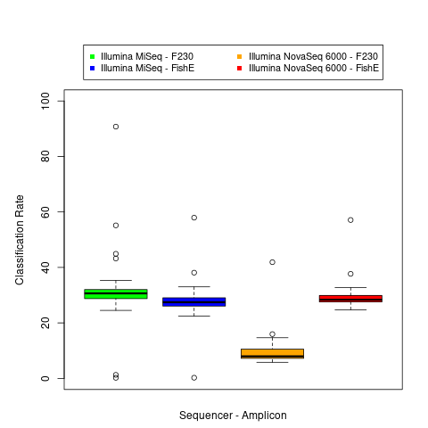
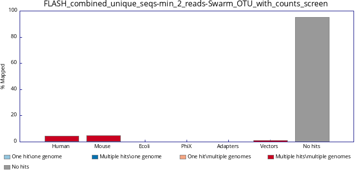
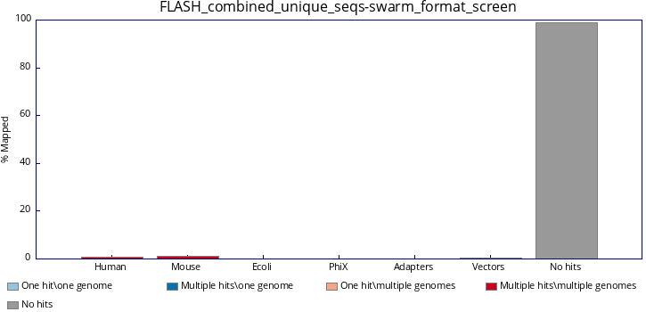
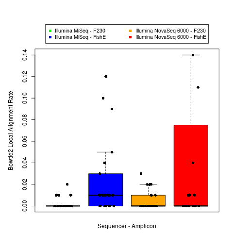
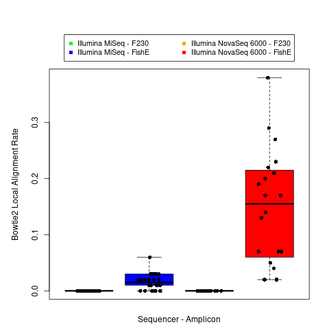
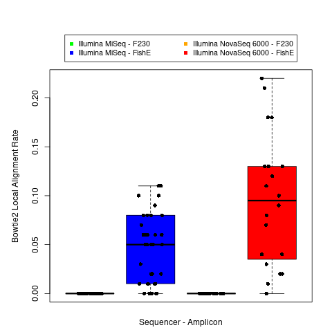
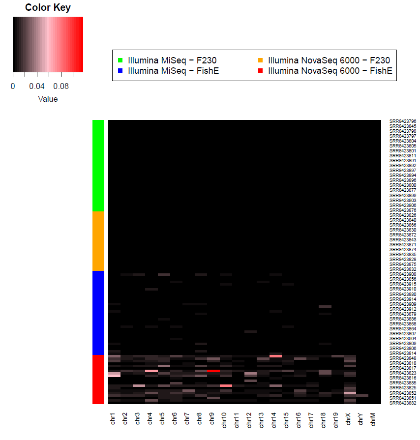

As noted in [this file](https://github.com/cwarden45/PRJNA513845-eDNA_reanalysis/blob/master/extended_summary.xlsx), there are considerable prokaryotic taxonomy assignments from the SRA.  Most commonly, those are for "*Candidatus Pelagibacter ubique*" and "*Candidatus Pelagibacter sp. HIMB1321*", but additional assignments are also made (particuarlly as sequencing depth increases).

So, I have tried to note some different strategies  for metagenomics analysis in order to compare to the SRA (before and after filtering)

**1)** [Kracken2](http://ccb.jhu.edu/software/kraken2/)/[Bracken](https://ccb.jhu.edu/software/bracken/)

*a)* Paired-end FASTQ analysis (for uploaded SRA data) with `run_Kracken2_Bracken-FASTQ-PE.py`
*b)* Single-end FASTQ analysis (for filtered and merged paired-end reads) with `run_Kracken2_Bracken-FASTQ-SE.py`

Either way, this should be followed by `tabulate_Kraken2-Braken_statistics.py`.

The amplicon type (F230 vs FishE) shows a noticabe difference for some metrics (more so than the sequencer).

However, aside from indiciating a non-trivial number of bacterial reads for eukaryotic amplicon sequencing, the classification rate was not as consistently different in a similar way between sequencers.

**Original SRA Downloaded Reads:**

**Cutadapt-Filtered and FLASH-Merged Reads:**

**Most Kraken2 assignments were bacterial**, so the plots above show the classification rate.  However, the uploaded text files also have the similar bacterial percentages.

I am not sure why the assignment rate drops for the FishE NovaSeq samples.  However, this might not necessarily be good.  For example, if there are more reads from other samples, then the biological origin might not be bacterial (it could be mouse or human, for example).

**2)** [Mash Screen](https://mash.readthedocs.io/en/latest/)

I am focusing on:

*a)* Single-end FASTQ analysis (for filtered and merged paired-end reads) with `run_MashScreen-FASTQ.py`
*b)* Unique sequence FASTA file (should also work for clustered /  corrected unique reads) `run_MashScreen-FASTA.py`

Option *b)* works, but you would have to figure out how to map each individual read for original abundance.  So, I will show the FASTQ result below.

More specifically, I think the taxonomy information would help for interpretation.  These results can still be useful and sometimes capture things not found my Kracken2.

However, for these purposes, I am focusing on the viral reads, as defined as those with "Viral" in the .fna.gz reference name.  Even though I am using the `-w` parameter to try and reduce duplicate hits for what is really the same reference, I am focusing on assignments with more than 1 read below:

**3)** [FastQ Screen](https://www.bioinformatics.babraham.ac.uk/projects/fastq_screen/)

If I create a "fake" FASTQ file from the FASTA file with the OTU sequences, then I can check if reads that are supported by less than 2 reads in at least 1 sample are more likely to come from human or mouse (possibly as cross-contamination from other lab's samples?) using `run_FastQ-Screen_OTU.sh`.

**Swarm OTU (FLASH-Merged, Min 2 Reads in Min 1 Sample)**:

**Swarm OTU (FLASH-Merged, All Unique Reads)**:

Qualitatively, I don't see much of a difference in the proportion when unique sequences present in less than 2 reads in all samples.  In terms of the exact counts:

<table>
  <tbody>
    <tr>
      <th align="center">Reference</th>
      <th align="center">All Unique Input n=26,155,839 OTU</th>
      <th align="center">Min 2 Reads in Min 1 Sample Input n=339,349 OTU</th>
    </tr>
    <tr>
	    <td align="center">Human</td>
      <td align="center">5,566 OTU (1 hit, 1 genome) 9,323 OTU (&gt1 hit, 1 genome)</td>
      <td align="center">178 OTU (1 hit, 1 genome) 99 OTU (&gt1 hit, 1 genome)</td>
    </tr>
    <tr>
	    <td align="center">Mouse</td>
      <td align="center">34,874 OTU (1 hit, 1 genome) 34,491 OTU (&gt1 hit, 1 genome)</td>
      <td align="center">621 OTU (1 hit, 1 genome) 1,101 OTU (&gt1 hit, 1 genome)</td>
    </tr>
    <tr>
	    <td align="center">Vectors</td>
      <td align="center">14 OTU (1 hit, 1 genome) 5 OTU (&gt1 hit, 1 genome)</td>
      <td align="center">2 OTU (1 hit, 1 genome) 0 OTU (&gt1 hit, 1 genome)</td>
    </tr>
</tbody>
</table>

So, additional sequences are being found, but I don't think they are substantially more likely to be found (although this might be enough if all OTUs count equally?).

That said, I thought it might have been unexpected that there were a lot more reads uniquely aligned ot the mouse genome than the human genome?  If I use a Bowtie2 alignment in the next section (to just the  mouse genome), then that will also include the reads mapped to multiple species (in the figure but not the table).  However, I will first check alignment against the COI sequence from which the primers were designed.

**4)** [COI](https://github.com/cwarden45/PRJNA513845-eDNA_reanalysis/blob/master/OTU_clustering/COI_ref.fa) reference alignment (`run_COI_Bowtie2-SE.py`, followed by `tabulate_Bowtie2_statistics.py`)

For these samples, I am not really primarily interested in the metagenomic assignments.  Instead, I am trying to get a sense of the off-target reads.  So, for that, calculating the unaligned read rate might be helpful for that goal.

**Swarm OTU (FLASH-Merged)**:

<table>
  <tbody>
    <tr>
      <th align="center">Bowtie2 Param</th>
      <th align="center">All Unique Input n=26,155,839 OTU</th>
      <th align="center">Min 2 Reads in Min 1 Sample Input n=339,349 OTU</th>
    </tr>
    <tr>
	    <td align="center">--end-to-end --sensitive (<b>default</b>)</td>
      <td align="center">&lt0.01% (1 read)</td>
      <td align="center">&lt0.01% (1 read)</td>
    </tr>
    <tr>
	    <td align="center">--end-to-end --very-sensitive</td>
      <td align="center">&lt0.01% (1 read)</td>
      <td align="center">&lt0.01% (1 read)</td>
    </tr>
    <tr>
	    <td align="center">--local --sensitive-local (<b>default for --local</b>)</td>
      <td align="center">0.03%</td>
      <td align="center">0.06%</td>
    </tr>
    <tr>
	    <td align="center">--local --very-sensitive-local</td>
      <td align="center">0.03%</td>
      <td align="center">0.06%</td>
    </tr>
</tbody>
</table>

*I am somewhat concerned about the substantial increase in OTU for sequences that are found in less than 2 reads in at least 1 sample.*

However, I think there should be some non-trivial alignment rate among sequence with OTU  defined from unique sequences found in at least 2 reads in 1 sample.  So, if a given configuration has a low alignment rate, then that is probably not the best way to define on-target sequences.

**I am *not* saying that I know the best strategy for getting some sense of variation in the off-target reads.**  However, I was hopeing to find something that would OK enough to go back and calculate the alignment as an abundance (rather than an OTU count).  This particular strategy might not have worked, but I a showing the analysis that  I performed.

THe following plots were then created using `COI_Bowtie2_plots.R`.

**Bowtie2 `--local` Alignment rate for All FLASH-Merged FASTQ (after DADA2 filtering)**:

**Bowtie2 `--local` Alignment rate for All PEAR-Merged FASTQ (after DADA2 filtering)**:

**Unfortunately, I am not entirely sure how to interpret these results, whose individual sample alignment rates are all low (all <0.2%).**

If I take the FastQ Screen results into consideration and I check alignment to the **mouse genome** (rather than the COI partial gene sequence) using `run_mm10_Bowtie2-SE.py`+`tabulate_Bowtie2_statistics.py`+`COI_Bowtie2_plots.R`, then this is what I see:

**Bowtie2 *Default* Alignment rate for All FLASH-Merged FASTQ (after DADA2 filtering)**:

**Bowtie2 *Default* Alignment rate for All PEAR-Merged FASTQ (after DADA2 filtering)**:

If I  use `mm10_Bowtie2_heatmap.R` for the FLASH-merged sequences, you can see that the [chrM](https://www.ncbi.nlm.nih.gov/gene/17708) alignments don't vary but the enrichment of sequence tends to be (at varying locations in the mouse genome; however, the highest percentages **among mm10-aligned reads** were in the NovaSeq F230 amplicons).

If I take **unaligned reads** into consideration (again, for the FLASH-merged reads), then I see what I was expecting (with highest percentages in the **NovaSeq FishE amplicons**)

**5)** [megablast](https://www.ncbi.nlm.nih.gov/books/NBK279668/) (from [BLAST+](https://ftp.ncbi.nlm.nih.gov/blast/executables/blast+/LATEST/)) on unique sequences using `run_megablast-FASTA.sh`

You may want to need to work with a reduced set of sequences (such as OTUs filtered by supporting reads).

**Swarm OTU (FLASH-Merged, FILTER MIN 100 READS PER OTU PER SAMPLE, Defined from Min 2 Reads in Min 1 Sample)**:

***Not Yet Completed (even with reduced set of reads)***
